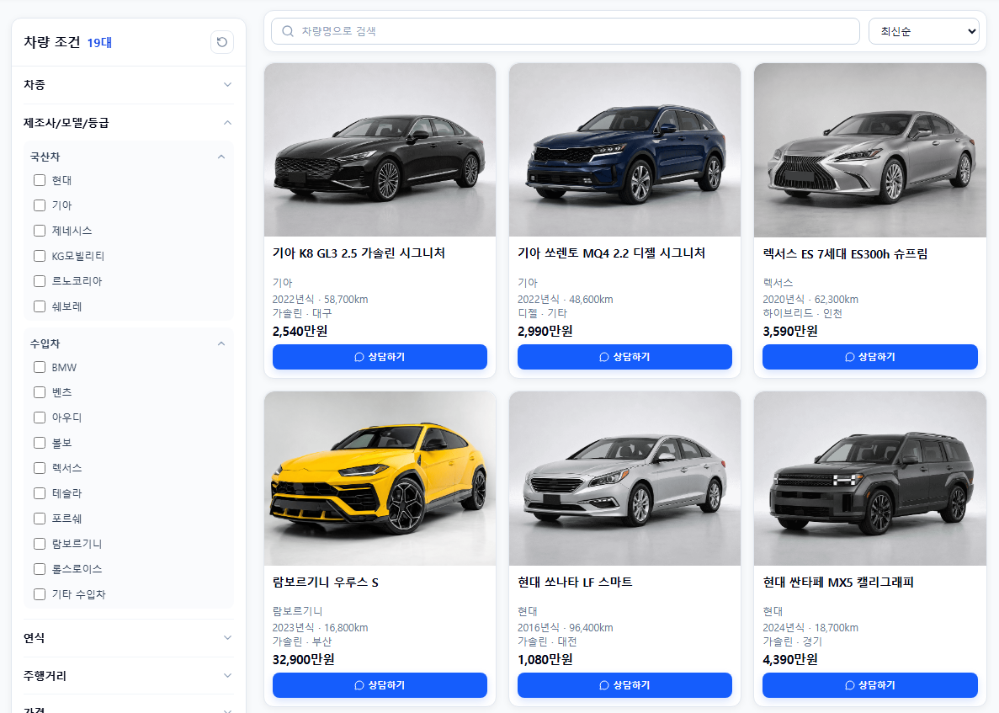
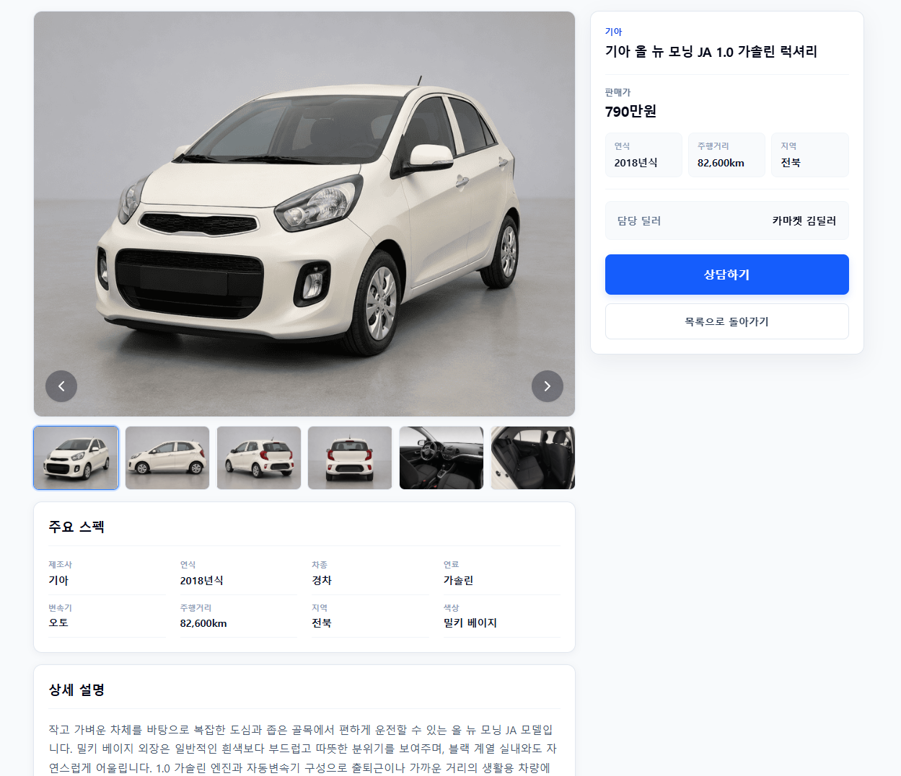
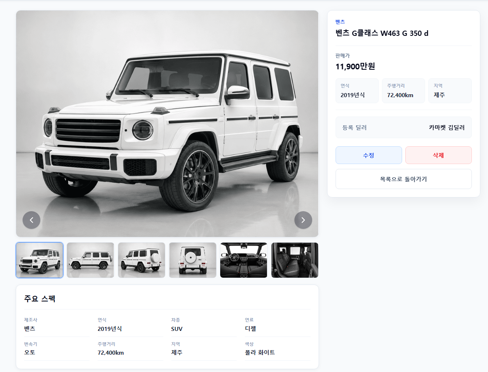
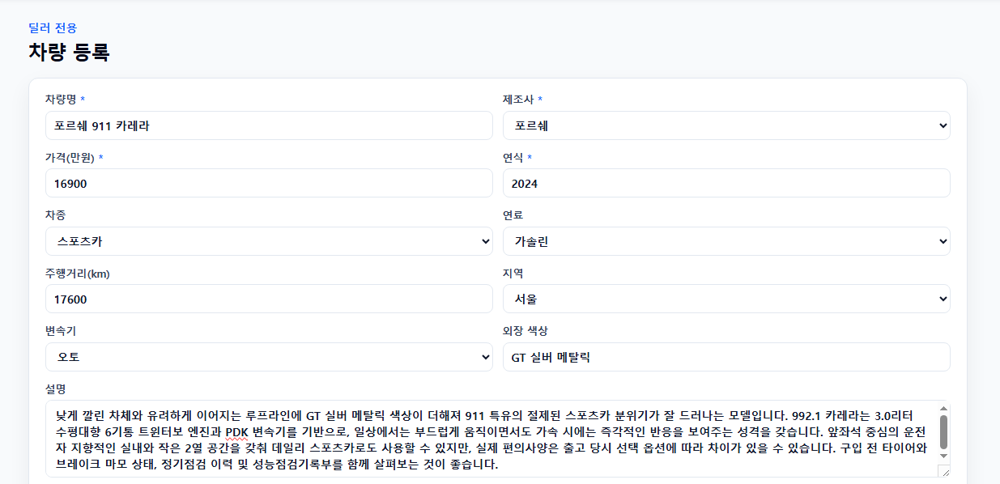
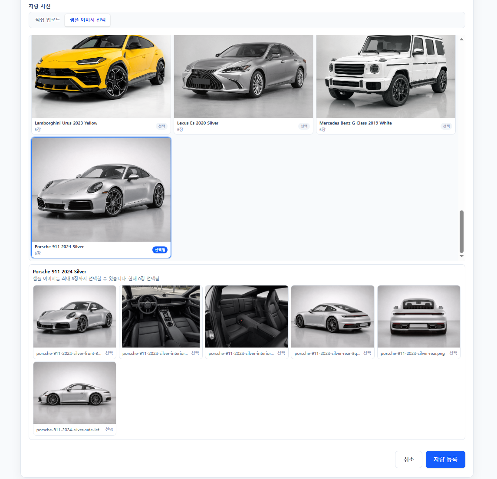
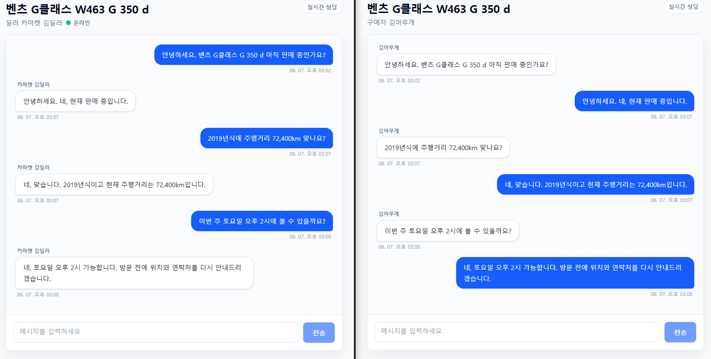
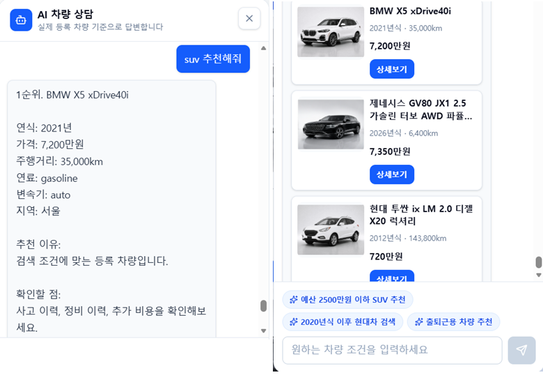

# CarMarket

CarMarket은 중고차 등록, 검색, 상세 조회, 실시간 상담 기능과 AI 차량 상담 기능을 제공하는 웹 서비스입니다.

AI 상담은 LangGraph 기반 Agent가 사용자의 자연어 조건을 분석하고, 기존 CarMarket REST API를 Tool로 호출해 실제 등록 차량을 추천하는 구조입니다. Python Agent 서버는 MongoDB에 직접 접근하지 않고, Node.js API를 통해서만 차량 데이터를 조회합니다.


## 배포 주소

- Frontend: [https://car-market-qxf3.onrender.com](https://car-market-qxf3.onrender.com)
- Backend: [https://car-market-server.onrender.com](https://car-market-server.onrender.com)

## 주요 기능

기본 기능:

- 차량 목록 조회
- 차량 조건 검색
- 차량 상세 조회
- 차량 등록, 수정, 삭제
- 로그인, 회원가입
- 구매자와 딜러 간 실시간 채팅 상담
- 차량 이미지 업로드 및 샘플 이미지 선택

AI 상담 기능:

- 제조사, 차종, 연료, 가격, 연식, 주행거리 조건 검색
- 국산차, 수입차 제조사 그룹 검색
- 억, 천, 만원 단위 자연어 가격 조건 처리
- 최소 가격과 최대 가격을 함께 사용하는 복합 가격 범위 검색
- 가격순, 연식순, 주행거리순 정렬
- 실제 등록 차량 기반 추천
- 추천 차량 카드 표시
- 정렬 조건이 없는 일반 추천의 세션 기반 다양성
- 같은 조건 반복 시 가능한 다른 차량 조합 추천
- 다른 차량 추천 시 이전 추천 차량 제외
- 후속 추천에서도 기존 제조사, 차종, 연료, 가격 범위, 정렬 조건 유지
- 잘못된 가격 범위 입력 시 검색 전에 안내
- 첫 번째 차량 상세 조회
- 첫 번째와 두 번째 차량 비교
- 딜러 문의 메시지 초안 작성
- 세션 기반 대화 문맥 유지

예시:

- `국산차 SUV 추천해줘`
- `1억 이하 외제차 SUV 추천해줘`
- `1억 이상 2억 이하 수입차 SUV 추천해줘`
- `3천만원 이상 5천만원 이하 SUV 추천해줘`
- `다른 기아차도 알려주세요`

## 전체 아키텍처

```text
React Client
    ↓
Node.js Express API
    ↓
MongoDB Atlas

React Client
    ↓
Node.js /api/agent/chat
    ↓
FastAPI Agent Server
    ↓
LangGraph Agent
    ↓
CarMarket REST API Tool
    ↓
Node.js Express API
    ↓
MongoDB Atlas
```

- React는 기존 Axios 인스턴스를 통해 Node API를 호출합니다.
- Node 서버는 일반 REST API와 AI 상담 프록시 역할을 함께 담당합니다.
- FastAPI Agent 서버는 LangGraph Agent를 실행합니다.
- AI Agent는 MongoDB에 직접 연결하지 않고, 기존 Node REST API를 Tool로 호출합니다.
- 차량 추천 카드의 데이터는 AI가 생성한 값이 아니라 실제 CarMarket API 조회 결과에서 가져옵니다.

## 기술 스택

Frontend:

- React
- Vite
- Tailwind CSS
- React Router
- Axios
- Firebase Authentication
- Socket.io Client
- lucide-react

Backend:

- Node.js
- Express
- MongoDB Atlas
- MongoDB Native Driver
- Socket.io
- Multer
- dotenv
- cors

AI Agent:

- Python
- FastAPI
- LangChain
- LangGraph
- OpenAI API
- LangSmith 선택 사용

Deployment:

- Render

## 폴더 구조

주요 폴더만 정리한 구조입니다.

```text
car-market/
├─ client/
│  ├─ public/images/
│  └─ src/
│     ├─ api/
│     ├─ components/
│     ├─ context/
│     ├─ data/
│     ├─ firebase/
│     ├─ pages/
│     └─ utils/
├─ server/
│  └─ src/
│     ├─ config/
│     ├─ controllers/
│     ├─ middleware/
│     ├─ routes/
│     ├─ services/
│     ├─ app.js
│     ├─ server.js
│     └─ socket.js
├─ ai-agent-server/
│  ├─ main.py
│  ├─ agent.py
│  ├─ tools.py
│  ├─ normalizers.py
│  ├─ query_parser.py
│  ├─ recommendation.py
│  ├─ followup_actions.py
│  ├─ session_store.py
│  ├─ response_formatter.py
│  ├─ requirements.txt
│  └─ .env.example
├─ docs/
└─ README.md
```

AI Agent 주요 파일:

- `main.py`: FastAPI 앱, CORS, `/agent/chat` 엔드포인트
- `agent.py`: LangGraph 실행 및 전체 상담 흐름 조정
- `tools.py`: 기존 CarMarket REST API를 호출하는 LangChain Tool
- `normalizers.py`: 제조사, 차종, 연료, 가격 단위, 차량 데이터 정규화
- `query_parser.py`: 사용자 문장에서 검색 조건, 가격 범위, 정렬, 후속 행동 추출
- `recommendation.py`: 추천 다양성, 정렬, 차량 선택
- `followup_actions.py`: 다른 차량, 상세, 비교, 딜러 메시지 처리
- `session_store.py`: 세션별 추천 상태 저장
- `response_formatter.py`: 추천, 상세, 비교 답변 생성

## 실행 방법

Node 서버:

```bash
cd server
npm install
npm start
```

FastAPI AI 서버 Windows:

```bash
cd ai-agent-server
python -m venv .venv
.venv\Scripts\activate
pip install -r requirements.txt
uvicorn main:app --reload --port 8000
```

FastAPI AI 서버 macOS/Linux:

```bash
cd ai-agent-server
python -m venv .venv
source .venv/bin/activate
pip install -r requirements.txt
uvicorn main:app --reload --port 8000
```

Windows에서 FastAPI를 재실행할 때는 8000번 포트에 이전 프로세스가 남아 있지 않은지 확인합니다.

React:

```bash
cd client
npm install
npm run dev
```

기본 주소:

```text
React: http://localhost:5173
Node API: http://localhost:3000
FastAPI: http://localhost:8000
Swagger: http://localhost:8000/docs
```

## 환경변수

실제 API 키와 비밀번호는 저장소에 커밋하지 않습니다. 각 폴더의 `.env.example`을 기준으로 `.env`를 작성합니다.

`server/.env.example`:

```env
PORT=3000
MONGODB_URI=
DB_NAME=car_market
CLIENT_URL=http://localhost:5173
AGENT_API_BASE=http://localhost:8000
```

`ai-agent-server/.env.example`:

```env
OPENAI_API_KEY=
OPENAI_MODEL=
CARMARKET_API_BASE=http://localhost:3000/api
CLIENT_URL=http://localhost:5173
LANGSMITH_TRACING=false
LANGSMITH_API_KEY=
LANGSMITH_PROJECT=carmarket-agent
```

Client에서 사용하는 환경변수:

```env
VITE_API_BASE_URL=http://localhost:3000
VITE_FIREBASE_API_KEY=
VITE_FIREBASE_AUTH_DOMAIN=
VITE_FIREBASE_PROJECT_ID=
VITE_FIREBASE_STORAGE_BUCKET=
VITE_FIREBASE_MESSAGING_SENDER_ID=
VITE_FIREBASE_APP_ID=
```

## AI 상담 테스트 질문

```text
기아차 추천해주세요
기아차 추천해주세요
2000만원 이하 기아 SUV 추천해줘
국산차 SUV 추천해줘
수입차 SUV 추천해줘
국산 전기차 추천해줘
1억 이하 외제차 SUV 추천해줘
1억 이상 2억 이하 수입차 SUV 추천해줘
3천만원 이상 5천만원 이하 SUV 추천해줘
SUV 비싼 가격순 추천해줘
최신 연식 SUV 추천해줘
주행거리 짧은 전기차 추천해줘
다른 기아차도 알려주세요
첫 번째 차량 상세 정보 알려줘
첫 번째와 두 번째 차량 비교해줘
첫 번째 차량 딜러에게 사고 이력과 추가 비용을 묻는 메시지 작성해줘
```

## API 요약

### Node.js API

Health:

```text
GET /api/health
```

Cars:

```text
GET /api/cars
GET /api/cars/search
GET /api/cars/:id
POST /api/cars
PUT /api/cars/:id
DELETE /api/cars/:id
```

Agent:

```text
POST /api/agent/chat
```

Users:

```text
POST /api/users
GET /api/users/me?uid=...
GET /api/users/dealers
```

Chats:

```text
POST /api/chats/rooms
GET /api/chats/rooms?uid=...
GET /api/chats/rooms/:roomId/messages?uid=...
POST /api/chats/rooms/:roomId/messages
PATCH /api/chats/rooms/:roomId/leave
```

Socket.io 이벤트:

- `join-room`
- `leave-room`
- `send-message`
- `receive-message`
- `dealer-online`
- `dealer-offline`

### FastAPI Agent

```text
GET /health
POST /agent/chat
GET /docs
```

## 프로젝트 문서

| 문서 | Markdown | PDF |
|---|---|---|
| 요구사항 정의서 | [보기](./docs/requirements/requirements.md) | [보기](./docs/requirements/requirements.pdf) |
| 와이어프레임 | [보기](./docs/wireframes/wireframes.md) | [보기](./docs/wireframes/wireframes.pdf) |

## 주요 화면

차량 목록과 필터:



차량 상세:



딜러 차량 관리:



차량 등록:



차량 이미지 선택:



실시간 상담:



AI 차량 상담:



## 배포 메모

Backend Render 설정:

- Root Directory: `server`
- Build Command: `npm install`
- Start Command: `npm start`
- 주요 환경변수: `MONGODB_URI`, `DB_NAME`, `CLIENT_URL`, `AGENT_API_BASE`

Frontend Render 설정:

- Root Directory: `client`
- Build Command: `npm install && npm run build`
- Publish Directory: `dist`
- 주요 환경변수: `VITE_API_BASE_URL`, `VITE_FIREBASE_*`
- React Router Rewrite: `/*` → `/index.html`

이미지 업로드 관련 주의:

- 샘플 차량 이미지는 `client/public/images/cars/`의 정적 파일을 사용합니다.
- Multer로 직접 업로드한 이미지는 서버 로컬 파일 시스템에 저장됩니다.
- Render 무료 환경에서는 재배포 또는 인스턴스 교체 시 직접 업로드한 파일이 사라질 수 있습니다.
- 운영 환경에서는 S3, Cloudinary, Firebase Storage 같은 외부 스토리지 연동이 필요합니다.

## 제한사항

- AI 세션 상태는 FastAPI 메모리 기반이라 서버 재시작 시 추천 이력과 대화 문맥이 초기화됩니다.
- 추천 결과는 실제 등록 차량 데이터에 의존합니다.
- 가격, 제조사, 차종, 연료 검색 정확도는 등록 차량 데이터의 `company`, `type`, `fuel`, `price` 값 표준화 상태에 영향을 받습니다.
- 국산차, 수입차 분류는 현재 등록된 제조사 코드 기준으로 관리되며, 새로운 제조사가 추가되면 제조사 그룹 목록도 갱신해야 합니다.
- OpenAI API 사용을 위해 별도 API 키와 사용 가능한 크레딧이 필요합니다.
- LangSmith 추적은 선택 사항입니다.
